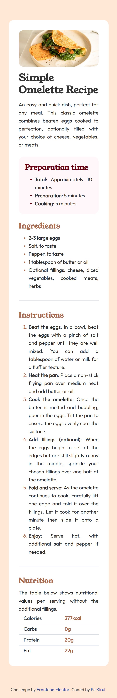
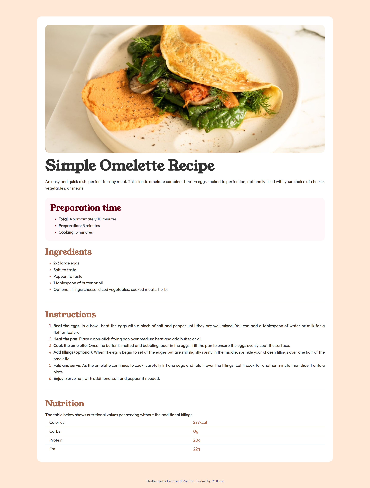

# Frontend Mentor - Recipe page solution

This is a solution to the [Recipe page challenge on Frontend Mentor](https://www.frontendmentor.io/challenges/recipe-page-KiTsR8QQKm). Frontend Mentor challenges help you improve your coding skills by building realistic projects.

## Table of contents

- [Overview](#overview)
  - [The challenge](#the-challenge)
  - [Screenshot](#screenshot)
  - [Links](#links)
- [My process](#my-process)
  - [Built with](#built-with)
  - [What I learned](#what-i-learned)
  - [Continued development](#continued-development)
  - [Useful resources](#useful-resources)
- [Author](#author)

## Overview

The challenge


This was a simple challenge by Frontend Mentor. I was able to build something closer to the design files given.

### Screenshot

Below are screenshots as viewed on mobile and laptop screens.

<div style="display: flex; align-items: center; justify-content: center; gap: 20px;">
  
  
</div>

<!--  -->

<!--  -->

### Links

- Solution URL: [Solution](https://github.com/Pc-Kirui/recipe-page)
- Live Site URL: [Live preview](https://pc-kirui.github.io/recipe-page/)

## My process

### Built with

- Semantic HTML5 markup
- CSS custom properties
- Mobile-first workflow

### What I learned

This was not a complex project, it assisted me in recapping what I have been learning in HTML5 and CSS.The key areas I reinforced were responsiveness, readability, semantics, accessibility, and scalability.

I also learned about CLS (Cumulative Layout Shift) and how to analyze it using Chrome Devtools and Lighthouse. CLS measures visual stability of a page, i.e it tracks how elements shifts unexpectedly as the page loads. In this project I learned how to fix CLS caused by images; below are code snippets demonstrating the solution.

```html
<figure class="recipe-img">
  
</figure>
```

```css
img {
  display: block;
  width: 100%;
  height: auto;
  border-radius: var(--radius);
}
```

I did it by specifying the width and height dimensions and using CSS to make it responsive. This technique enables the browsers to calculate aspect ratio before the image loads, allowing them to instantly reserve correct space and thus prevent layout shifts.

### Continued development

- Responsive Design
- Semantic HTML
- Core Web Vitals

### Useful resources

- [Cumulative Layout Shift](https://web.dev/articles/cls) - This helped me to understand more about CLS.

## Author

- Website - [Patrick C Kirui](https://pc-kirui.github.io/)
- Frontend Mentor - [@Pc-Kirui](https://www.frontendmentor.io/profile/Pc-Kirui)
- Twitter - [@PcKirui](https://x.com/PcKirui)
